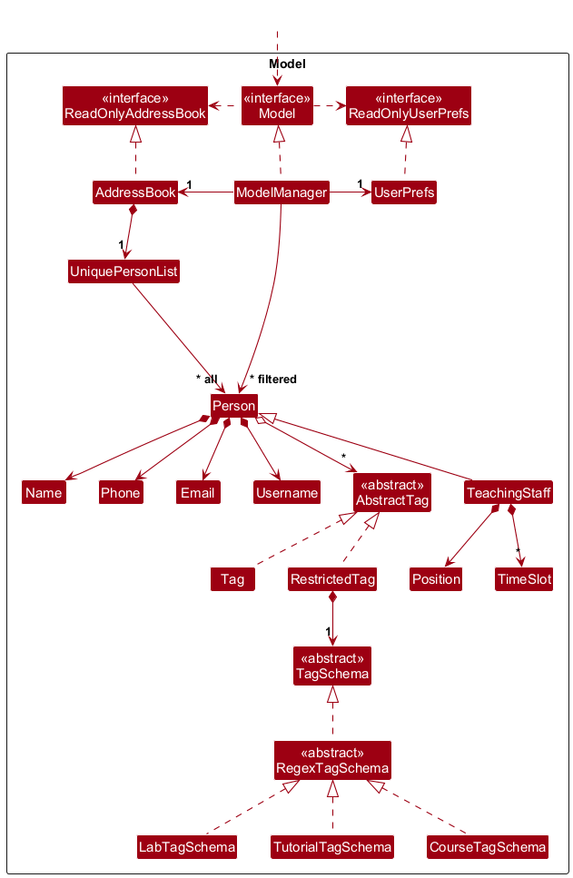
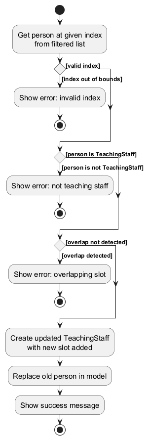
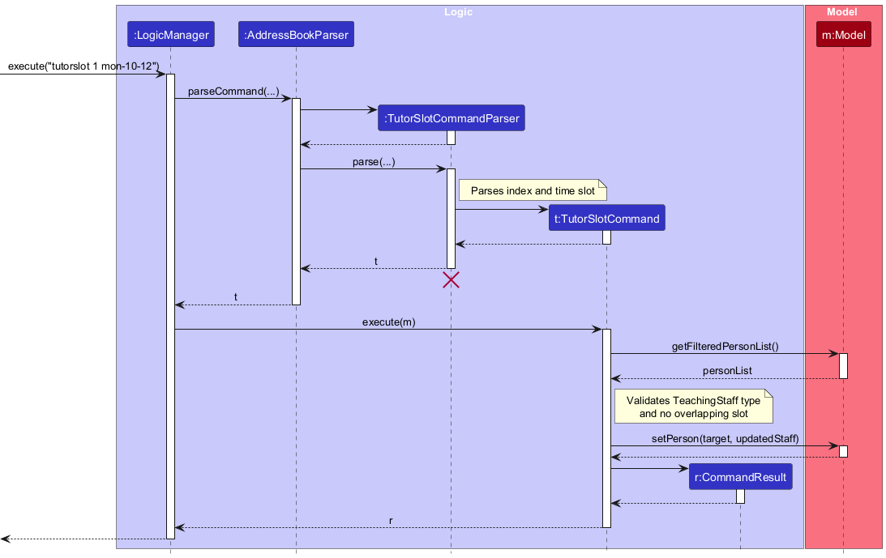
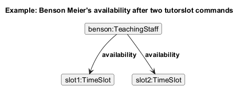
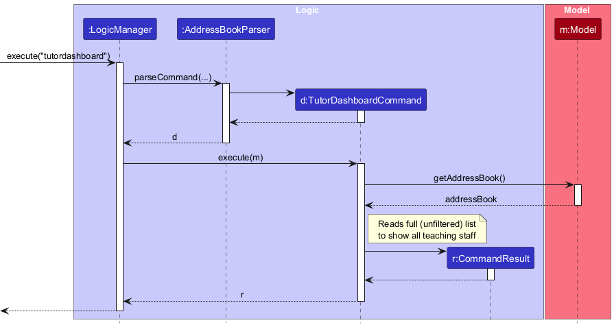
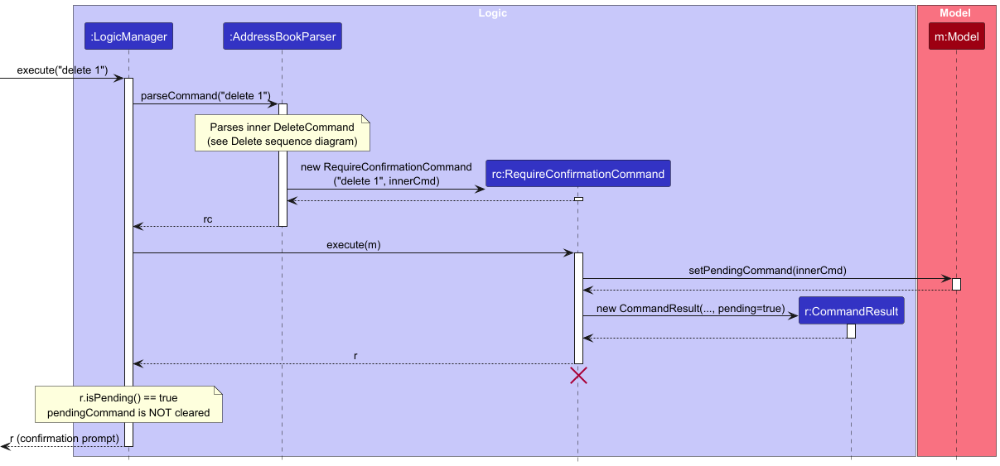
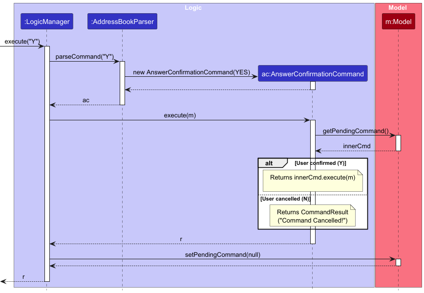

* Table of Contents
{:toc}

--------------------------------------------------------------------------------------------------------------------

## **Acknowledgements**

* {list here sources of all reused/adapted ideas, code, documentation, and third-party libraries -- include links to the
  original source as well}

--------------------------------------------------------------------------------------------------------------------

## **Setting up, getting started**

Refer to the guide [_Setting up and getting started_](SettingUp.md).

--------------------------------------------------------------------------------------------------------------------

## **Design**

:bulb: **Tip:** The `.puml` files used to create diagrams are in this document `docs/diagrams` folder. Refer to the [
_PlantUML Tutorial_ at se-edu/guides](https://se-education.org/guides/tutorials/plantUml.html) to learn how to create
and edit diagrams.

### Architecture

The ***Architecture Diagram*** given above explains the high-level design of the App.

Given below is a quick overview of main components and how they interact with each other.

**Main components of the architecture**

**`Main`** (consisting of classes [
`Main`](https://github.com/AY2526S2-CS2103-F13-4/tp/tree/master/src/main/java/seedu/address/Main.java) and [
`MainApp`](https://github.com/AY2526S2-CS2103-F13-4/tp/tree/master/src/main/java/seedu/address/MainApp.java)) is in
charge of the app launch and shut down.

* At app launch, it initializes the other components in the correct sequence, and connects them up with each other.
* At shut down, it shuts down the other components and invokes cleanup methods where necessary.

The bulk of the app's work is done by the following four components:

* [**`UI`**](#ui-component): The UI of the App.
* [**`Logic`**](#logic-component): The command executor.
* [**`Model`**](#model-component): Holds the data of the App in memory.
* [**`Storage`**](#storage-component): Reads data from, and writes data to, the hard disk.

[**`Commons`**](#common-classes) represents a collection of classes used by multiple other components.

**How the architecture components interact with each other**

The *Sequence Diagram* below shows how the components interact with each other for the scenario where the user issues
the command `delete 1`.

Each of the four main components (also shown in the diagram above),

* defines its *API* in an `interface` with the same name as the Component.
* implements its functionality using a concrete `{Component Name}Manager` class (which follows the corresponding API
  `interface` mentioned in the previous point.

For example, the `Logic` component defines its API in the `Logic.java` interface and implements its functionality using
the `LogicManager.java` class which follows the `Logic` interface. Other components interact with a given component
through its interface rather than the concrete class (reason: to prevent outside component's being coupled to the
implementation of a component), as illustrated in the (partial) class diagram below.

The sections below give more details of each component.

### UI component

The **API** of this component is specified in [
`Ui.java`](https://github.com/AY2526S2-CS2103-F13-4/tp/tree/master/src/main/java/seedu/address/ui/Ui.java)

The UI consists of a `MainWindow` that is made up of parts e.g.`CommandBox`, `ResultDisplay`, `PersonListPanel`,
`StatusBarFooter` etc. All these, including the `MainWindow`, inherit from the abstract `UiPart` class which captures
the commonalities between classes that represent parts of the visible GUI.

The `UI` component uses the JavaFx UI framework. The layout of these UI parts are defined in matching `.fxml` files that
are in the `src/main/resources/view` folder. For example, the layout of the [
`MainWindow`](https://github.com/AY2526S2-CS2103-F13-4/tp/tree/master/src/main/java/seedu/address/ui/MainWindow.java)
is specified in [
`MainWindow.fxml`](https://github.com/AY2526S2-CS2103-F13-4/tp/tree/master/src/main/resources/view/MainWindow.fxml)

The `UI` component,

* executes user commands using the `Logic` component.
* listens for changes to `Model` data so that the UI can be updated with the modified data.
* keeps a reference to the `Logic` component, because the `UI` relies on the `Logic` to execute commands.
* depends on some classes in the `Model` component, as it displays `Person` object residing in the `Model`.

### Logic component

**API** : [
`Logic.java`](https://github.com/AY2526S2-CS2103-F13-4/tp/tree/master/src/main/java/seedu/address/logic/Logic.java)

Here's a (partial) class diagram of the `Logic` component:

The sequence diagrams below illustrate the interactions within the `Logic` component for representative commands.

`execute("delete 1")`:

:information_source: **Note:** The lifeline for `DeleteCommandParser` should end at the destroy marker (X) but due to a limitation of PlantUML, the lifeline continues till the end of diagram.

`execute("add n/John ...")`:

:information_source: **Note:** The lifeline for `AddCommandParser` should end at the destroy marker (X) but due to a limitation of PlantUML, the lifeline continues till the end of diagram.

`execute("list")`:

How the `Logic` component works:

1. When `Logic` is called upon to execute a command, it is passed to an `AddressBookParser` object which in turn creates
   a parser that matches the command (e.g., `DeleteCommandParser`) and uses it to parse the command.
1. This results in a `Command` object (more precisely, an object of one of its subclasses e.g., `DeleteCommand`) which
   is executed by the `LogicManager`.
1. The command can communicate with the `Model` when it is executed (e.g. to delete a person). 
   Note that although this is shown as a single step in the diagram above (for simplicity), in the code it can take
   several interactions (between the command object and the `Model`) to achieve.
1. The result of the command execution is encapsulated as a `CommandResult` object which is returned back from `Logic`.

Here are the other classes in `Logic` (omitted from the class diagram above) that are used for parsing a user command:

How the parsing works:

* When called upon to parse a user command, the `AddressBookParser` class creates an `XYZCommandParser` (`XYZ` is a
  placeholder for the specific command name e.g., `AddCommandParser`) which uses the other classes shown above to parse
  the user command and create a `XYZCommand` object (e.g., `AddCommand`) which the `AddressBookParser` returns back as a
  `Command` object. For example, `AddCommandParser` handles both `add` (student) and `add staff` (teaching staff) by
  inspecting the preamble; list filtering is handled by `ListCommand`, `StaffListCommand`, and `StudentListCommand`.
* All `XYZCommandParser` classes (e.g., `AddCommandParser`, `DeleteCommandParser`, ...) inherit from the `Parser`
  interface so that they can be treated similarly where possible e.g, during testing.

### Model component

**API** : [
`Model.java`](https://github.com/AY2526S2-CS2103-F13-4/tp/tree/master/src/main/java/seedu/address/model/Model.java)

The `Model` component,

* stores the address book data i.e., all `Person` objects (which are contained in a `UniquePersonList` object). A person
  may be a student (base `Person`) or teaching staff (`TeachingStaff`, which extends `Person` and adds a `Position`
  field; allowed values are "Teaching Assistant" and "Professors").
* stores the currently 'selected' `Person` objects (e.g., results of a search query or list filter) as a separate
  _filtered_ list which is exposed to outsiders as an unmodifiable `ObservableList<Person>` that can be 'observed' e.g.
  the UI can be bound to this list so that the UI automatically updates when the data in the list change. Commands such
  as `list`, `staffslist`, and `studentslist` update this filter to show all persons, only teaching staff, or only
  students respectively.
* stores a `UserPref` object that represents the user’s preferences. This is exposed to the outside as a
  `ReadOnlyUserPref` objects.
* does not depend on any of the other three components (as the `Model` represents data entities of the domain, they
  should make sense on their own without depending on other components)

:information_source: **Note:** An alternative (arguably, a more OOP) model is given below. It has a `Tag` list in the `AddressBook`, which `Person` references. This allows `AddressBook` to only require one `Tag` object per unique tag, instead of each `Person` needing their own `Tag` objects. 

### Storage component

**API** : [
`Storage.java`](https://github.com/AY2526S2-CS2103-F13-4/tp/tree/master/src/main/java/seedu/address/storage/Storage.java)

The `Storage` component,

* can save both address book data and user preference data in JSON format, and read them back into corresponding
  objects.
* inherits from both `AddressBookStorage` and `UserPrefStorage`, which means it can be treated as either one (if only
  the functionality of only one is needed).
* depends on some classes in the `Model` component (because the `Storage` component's job is to save/retrieve objects
  that belong to the `Model`)

### Common classes

Classes used by multiple components are in the `seedu.address.commons` package.

--------------------------------------------------------------------------------------------------------------------

## **Implementation**

This section describes some noteworthy details on how certain features are implemented.

### Person and TeachingStaff

The address book holds a single list of `Person` objects. Two types of persons are supported:

* **Students** — base `Person` instances, added with `add n/NAME p/... e/... u/...`.
* **Teaching staff** — `TeachingStaff` instances (extend `Person`) with an additional `Position` field. Added with
  `add staff n/NAME p/... e/... u/... [pos/POSITION]` where name, phone, email, username are mandatory and
  `pos/POSITION` is optional. `Position` is restricted to "Teaching Assistant" or "Professors".

Phone numbers are validated as Singapore numbers (`[3689]\\d{7}`): exactly 8 digits, starting with 3, 6, 8, or 9.

The UI and commands treat both types uniformly as `Person` where possible (e.g. `find`, `delete` by index). The filtered
list in the model can show all persons (`list`), only teaching staff (`staffslist`), or only students (`studentslist`)
by setting a predicate on the underlying list. `edit` supports an optional `pos/POSITION` field that applies only to
teaching staff.

### Tagging System
`AbstractTag`s are optionally allowed to be added to any Person/TeachingStaff. These are further divided into two groups: `Tag` and `RestrictedTag`. (See [Model Component](#model-component))

Either variant of tag can constructed using `TagFactory.create(tag)`. Which one created depends on the format of the tag provided. The following rule is utilised: a `RestrictedTag` will use `:` as a delimiter (e.g. tut:A10). Otherwise, it is treated as `Tag`.

#### Tag Validation Flow
- Tag: A simple Regex is used to determine if it is valid (alphanumeric only)
- RestrictedTag (`prefix`:`value`)
  1. A schema of the registered `prefix` is selected (See `TagFactory.getAssociatedSchema()`)
  2. A `RestrictedTag` is constructed with the corresponding schema
  3. `RestrictedTag`'s constructor will pass `value` into the schema to check against its own specified validation method
  4. Should validation fail, an error is thrown

### Tutor Availability Scheduling

#### Overview

Teaching staff members can specify when they are available to teach using the `tutorslot` command. This feature adds a
`Set<TimeSlot>` field to the `TeachingStaff` model, where each `TimeSlot` represents a day-of-week and time range (e.g.,
Monday 10:00–12:00).

#### Implementation

The feature is implemented across the following components:

**Model:**

* `TimeSlot` — An immutable value object containing a `DayOfWeek`, a `LocalTime` start, and a `LocalTime` end. Supports
  parsing from string format `DAY-START-END` (e.g., `mon-10-12`). Implements `Comparable<TimeSlot>` for sorted display.
  Crossing-midnight slots are intentionally not supported in this format.
* `TeachingStaff` — Extended with a `Set<TimeSlot> availability` field. A new constructor accepts availability alongside
  existing fields. The `getAvailability()` method returns an unmodifiable set.

**Logic:**

* `TutorSlotCommand` — Takes an `Index` and a `TimeSlot`. On execution, it:
    1. Retrieves the person at the given index from the filtered list.
    2. Validates that the person is a `TeachingStaff` instance.
    3. Checks for overlapping time slots on the same day (exact duplicates are a subset of overlap).
    4. Constructs a new `TeachingStaff` with the slot added (preserving immutability).
    5. Replaces the old person in the model via `Model#setPerson()`.
* `TutorSlotCommandParser` — Parses `INDEX SLOT` from user input, delegating to `ParserUtil#parseTimeSlot()` for
  validation.

**Storage:**

* `JsonAdaptedTimeSlot` — Serialises a `TimeSlot` as its string representation (e.g., `"mon-10-12"`) using `@JsonValue`.
* `JsonAdaptedPerson` — Extended with a `List<JsonAdaptedTimeSlot> availability` field, serialised only for staff-type
  persons.

The following activity diagram summarises the decision flow when `tutorslot` is executed:

The following sequence diagram shows how the `tutorslot 1 mon-10-12` command flows through the `Logic` component:

:information_source: **Note:** The lifeline for `TutorSlotCommandParser` should end at the destroy marker (X) but due to a limitation of PlantUML, the lifeline continues till the end of the diagram.

The object diagram below shows an example state of a `TeachingStaff` object after two `tutorslot` commands have been
executed:

#### Viewing Availability: `tutordashboard`

The `TutorDashboardCommand` is a read-only command that produces a formatted availability summary for all teaching
staff.

Key design decisions:

* **Reads from the full address book** (`model.getAddressBook().getPersonList()`), not the filtered list. This ensures
  the dashboard is always complete even when the user has filtered to show only students.
* **Sorted display** — slots for each staff member are inserted into a `TreeSet`, which uses `TimeSlot`'s natural
  ordering (day-of-week first, then start time) via its `Comparable` implementation.
* **No model mutation** — the command produces only a `CommandResult`; it does not modify any data.
* **No parser needed** — the command takes no arguments and is returned directly by `AddressBookParser`.
  Extra trailing arguments are currently ignored for no-argument commands (e.g., `tutordashboard foo`).

The following sequence diagram shows how the `tutordashboard` command is executed:

#### Design Considerations

**Aspect: Where to store availability**

* **Alternative 1 (current choice):** Store `Set<TimeSlot>` directly in `TeachingStaff`.
    * Pros: Simple, self-contained. Each staff member owns their availability data.
    * Cons: Adding a slot requires constructing a new `TeachingStaff` (immutability constraint).

* **Alternative 2:** Store availability in a separate `AvailabilityManager` in the model.
    * Pros: Decouples availability from the person model; easier to query across all staff.
    * Cons: Adds complexity; requires cross-referencing persons by identity.

### Export Contacts Feature

#### Overview

The `export` command allows users to export all contacts in the address book to a CSV file. This feature enables users
to back up their data or share contacts with others in a common CSV format.

#### Implementation

The feature is implemented across the following components:

**Logic:**

* `ExportCommand` — Takes a file path as a parameter. On execution, it:
    1. Calls `CsvExporter#exportContacts(Model, filePath)` to export all contacts to the specified file.
    2. Returns a `CommandResult` with a success message containing the file path.
    3. Throws `CommandException` if an `IOException` occurs during the export process.
* `ExportCommandParser` — Parses user input with optional file path prefix `f/`. If no file path is provided, uses the
  default location (`./export.csv`).

**Storage:**

* `CsvExporter` — Utility class responsible for:
    1. Converting each `Person` to CSV format using `convertToCSV(Person)`.
    2. Writing all contacts to the specified CSV file.
    3. Handling both students and teaching staff, including tags and time slots for staff.

**Command Format:**

* `export` — Exports to `./export.csv` (default location).
* `export f/FILE_PATH` — Exports to the specified file path.

#### Design Considerations

**Aspect: Where to place export logic**

* **Alternative 1 (current choice):** Place export logic in `CsvExporter` utility class in the storage component.
    * Pros: Separates export logic from command logic; reusable; easy to add other export formats.
    * Cons: Storage component has some export responsibilities.

* **Alternative 2:** Place all export logic in `ExportCommand`.
    * Pros: Command-specific logic is contained in the command.
    * Cons: Harder to test independently; less reusable.

### Import Contacts Feature

#### Overview

The `import` command allows users to import contacts in the address book from a CSV file.
This allows users to a way restore accidentally deleted contacts and to add multiple contacts quickly.

#### Implementation

The feature is implemented across the following components:

**Logic:**

* `ImportCommand` — Takes a file path as a parameter. On execution, it:
    1. Calls `CsvImporter#importContacts(Model, filePath)` to import all contacts that currently do not exist.
    2. Returns a `CommandResult` with a success message containing the file path.
    3. Throws `CommandException` if an `IOException` occurs during the import process or when the csv file is corrupted,
       i.e, has invalid format, resulting in a `DeserialisePersonException`.
* `ImportCommandParser` — Parses user input with compulsory file path prefix `f/`.

**Storage:**

* `CsvImporter — Utility class responsible for:
    1. Reading from the csv file containing all the contacts.
    2. Converting each CSV formatted string (representing a person) into a `Person` via
       `CsvImporter#deserialisePerson(personStrRep)`

**Command Format:**

* `import f/FILE_PATH` — Imports contacts from the specified file path.

#### Design Considerations

**Aspect: Where to place export logic**

* **Alternative 1 (current choice):** Place import logic in `CsvImporter` utility class in the storage component.
    * Pros: Able to test the logic for deserialisation and import easily and separately from the command execution.
    * Cons: Storage component contains deserialisation logic which is outside the scope of responsbilities of the
      storage
      component.

* **Alternative 2:** Place all import logic in `ImportCommand`.
    * Pros: The logic is contained within a single class, making it easy to read and understand.
    * Cons: Difficult to test deserialisation logic separately.

### Double Confirmation

#### Overview

Certain commands that are destructive or irreversible — currently `delete` and `clear` — require the user to explicitly confirm before they are executed. These commands implement the `CriticalCommand` marker interface, which causes `AddressBookParser` to intercept them and wrap them in a `RequireConfirmationCommand` instead of executing them directly.

#### Implementation

The feature introduces the following classes:

* `CriticalCommand` — Marker interface. Any command implementing it will be intercepted by `AddressBookParser` and require confirmation before execution.
* `RequireConfirmationCommand` — Wraps a `CriticalCommand`. On execution, it stores the wrapped command as a pending command in `Model` and returns a `CommandResult` with `pending=true`, prompting the user to confirm.
* `AnswerConfirmationCommand` — Handles the user's `Y` or `N` response. On `Y`, it retrieves and executes the pending command from `Model`. On `N`, it returns a cancellation message.
* `CommandResult#isPending()` — Flag that tells `LogicManager` not to clear the pending command from `Model` when `true`.
* `Model#pendingCommand` — Field in `ModelManager` that holds the deferred command between the two interactions.

The following sequence diagram shows how a critical command (e.g. `delete 1`) is intercepted and a confirmation prompt is issued:

The following sequence diagram shows how the user's answer (`Y` to confirm, `N` to cancel) is handled:

### \[Proposed\] Undo/redo feature

#### Proposed Implementation

The proposed undo/redo mechanism is facilitated by `VersionedAddressBook`. It extends `AddressBook` with an undo/redo
history, stored internally as an `addressBookStateList` and `currentStatePointer`. Additionally, it implements the
following operations:

* `VersionedAddressBook#commit()`— Saves the current address book state in its history.
* `VersionedAddressBook#undo()`— Restores the previous address book state from its history.
* `VersionedAddressBook#redo()`— Restores a previously undone address book state from its history.

These operations are exposed in the `Model` interface as `Model#commitAddressBook()`, `Model#undoAddressBook()` and
`Model#redoAddressBook()` respectively.

Given below is an example usage scenario and how the undo/redo mechanism behaves at each step.

Step 1. The user launches the application for the first time. The `VersionedAddressBook` will be initialized with the
initial address book state, and the `currentStatePointer` pointing to that single address book state.

Step 2. The user executes `delete 5` command to delete the 5th person in the address book. The `delete` command calls
`Model#commitAddressBook()`, causing the modified state of the address book after the `delete 5` command executes to be
saved in the `addressBookStateList`, and the `currentStatePointer` is shifted to the newly inserted address book state.

Step 3. The user executes `add n/David …​` to add a new person. The `add` command also calls
`Model#commitAddressBook()`, causing another modified address book state to be saved into the `addressBookStateList`.

:information_source: **Note:** If a command fails its execution, it will not call `Model#commitAddressBook()`, so the address book state will not be saved into the `addressBookStateList`.

Step 4. The user now decides that adding the person was a mistake, and decides to undo that action by executing the
`undo` command. The `undo` command will call `Model#undoAddressBook()`, which will shift the `currentStatePointer` once
to the left, pointing it to the previous address book state, and restores the address book to that state.

:information_source: **Note:** If the `currentStatePointer` is at index 0, pointing to the initial AddressBook state, then there are no previous AddressBook states to restore. The `undo` command uses `Model#canUndoAddressBook()` to check if this is the case. If so, it will return an error to the user rather
than attempting to perform the undo.

The following sequence diagram shows how an undo operation goes through the `Logic` component:

:information_source: **Note:** The lifeline for `UndoCommand` should end at the destroy marker (X) but due to a limitation of PlantUML, the lifeline reaches the end of diagram.

Similarly, how an undo operation goes through the `Model` component is shown below:

The `redo` command does the opposite — it calls `Model#redoAddressBook()`, which shifts the `currentStatePointer` once
to the right, pointing to the previously undone state, and restores the address book to that state.

:information_source: **Note:** If the `currentStatePointer` is at index `addressBookStateList.size() - 1`, pointing to the latest address book state, then there are no undone AddressBook states to restore. The `redo` command uses `Model#canRedoAddressBook()` to check if this is the case. If so, it will return an error to the user rather than attempting to perform the redo.

Step 5. The user then decides to execute the command `list`. Commands that do not modify the address book, such as
`list`, will usually not call `Model#commitAddressBook()`, `Model#undoAddressBook()` or `Model#redoAddressBook()`. Thus,
the `addressBookStateList` remains unchanged.

Step 6. The user executes `clear`, which calls `Model#commitAddressBook()`. Since the `currentStatePointer` is not
pointing at the end of the `addressBookStateList`, all address book states after the `currentStatePointer` will be
purged. Reason: It no longer makes sense to redo the `add n/David …​` command. This is the behavior that most modern
desktop applications follow.

The following activity diagram summarizes what happens when a user executes a new command:

#### Design considerations:

**Aspect: How undo & redo executes:**

* **Alternative 1 (current choice):** Saves the entire address book.
    * Pros: Easy to implement.
    * Cons: May have performance issues in terms of memory usage.

* **Alternative 2:** Individual command knows how to undo/redo by
  itself.
    * Pros: Will use less memory (e.g. for `delete`, just save the person being deleted).
    * Cons: We must ensure that the implementation of each individual command are correct.

_{more aspects and alternatives to be added}_

### \[Proposed\] Data archiving

_{Explain here how the data archiving feature will be implemented}_

--------------------------------------------------------------------------------------------------------------------

## **Documentation, logging, testing, configuration, dev-ops**

* [Documentation guide](Documentation.md)
* [Testing guide](Testing.md)
* [Logging guide](Logging.md)
* [Configuration guide](Configuration.md)
* [DevOps guide](DevOps.md)

--------------------------------------------------------------------------------------------------------------------

## **Appendix: Requirements**

### Product scope

**Product:** Doritus — An address book software for NUS teaching staff to manage student contacts.

**Target user profile**:

* NUS teaching staff (lecturers, instructors, and teaching assistants) who manage hundreds to thousands of students each
  semester
* prefer desktop apps that run locally on their own laptops
* can type fast and are comfortable with command-style (CLI-like) interfaces
* frequently need to retrieve student context quickly during emails, grading, and office hours
* need to organise students by module, tutorial, and lab group, and to reset cohorts each semester while keeping old
  records for reference

**Value proposition**:

* Focusing on the unique hierarchy of campus life.
* Mapping students by course codes, TAs by labs and tutorials.
* Allows a professor or teaching assistant to retrieve vital contact context or generate student lists quickly
* Ensuring that managing a massive network of names never interrupts the flow of deep work or teaching.

### User stories

Priorities: High (must have) - `* * *`, Medium (nice to have) - `* *`, Low (unlikely to have) - `*`

| Priority | As a …​                            | I want to …​                                           | So that I can…​                                                        |
|----------|------------------------------------|--------------------------------------------------------|------------------------------------------------------------------------|
| `* * *`  | new user                           | see usage instructions                                 | refer to instructions when I forget how to use the Doritus             |
| `* * *`  | user                               | add a new contact                                      | store their student ID and contact details for future reference        |
| `* * *`  | user                               | delete a contact                                       | remove withdrawn students or duplicate entries                         |
| `* * *`  | user                               | find a person by name or ID                            | locate details of persons without having to go through the entire list |
| `* * *`  | professor                          | add tags to contacts                                   | categorize students by course, tutorial, or lab                        |
| `* *`    | professor that teach many students | sort persons by name or ID                             | locate a person easily                                                 |
| `* *`    | professor that teach many courses  | search persons by tags                                 | locate details of persons in a course, tutorial, or lab easily         |
| `* *`    | forgetful user                     | do fuzzy and partially maching search                  | locate a person without remembring the full name of that person        |
| `*`      | professor that works in a group    | selectively import and export contacts in some formats | share contacts data with others                                        |
| `* *`    | user                               | see contextual error messages when a command fails     | know what is the problem and fix it                                    |
| `*`      | user                               | access my input history                                | run similar commands easily                                            |
| `* *`    | sloppy user                        | double confirm some dangerous operations               | keep my contacts data safe from mistakes                               |
| `*`      | sloppy user                        | undo some commands                                     | revert the effects of mistakes                                         |
| `*`      | user                               | have some customized configuration options             | customize this software to improve my efficiency and comfort           |
| `* *`    | professor                          | archive a completed semester’s cohort                  | start each new semester with a clean state                             |
| `*`      | professor                          | record short notes about students                      | recall important context when meeting them again in future semesters   |
| `* *`    | tutor/professor                    | state when I am available to teach                     | specify my availability so students know when I can teach              |
| `* *`    | tutor/professor                    | view the availability of all tutors in one place       | see who is able to teach at a glance                                   |

### Use cases

(For all use cases below, the **System** is the `Doritus` and the **Actor** is the `user`, unless specified otherwise)

**Use case: UC01 - Add a contact**

**MSS**

1. User requests to add a person with all required details.
2. System adds the person.

   Use case ends.

**Extensions**

* 1a. User does not provide all required details.

    * 1a1. System shows an error message.

      Use case resumes at step 1.

* 1b. User provides invalid details. (e.g., invalid name format)

    * 1b1. System shows an error message.

      Use case resumes at step 1.

**Use case: UC02 - Delete a contact**

**MSS**

1. User requests to show all contacts.
2. System shows contacts.
3. User requests to delete a contact by index.
4. System remove the contact.

   Use case ends.

**Extensions**

* 3a. User locate the contact to be deleted by other fields. (e.g. name, email)

    * 3a1. System remove the contact.

      Use case ends.

**Use case: UC03 - find a person by name**

**MSS**

1. User requests to find a person by name, phone, email or username
2. System shows a list of persons whose names match the search query

   Use case ends.

**Extensions**

* 1a. User does not provide a search query.

    * 1a1. System shows an error message.

      Use case resumes at step 1.

* 1b. User provides an invalid search query (e.g., invalid name format).

    * 1b1. System shows an error message.

      Use case resumes at step 1.

**Use case: UC04 – Add tags to a student**

**MSS**

1. User requests to show all contacts.
2. Doritus shows contacts.
3. User identifies the correct student and notes their `index` in the displayed list.
4. User enters a list of tags to be added to the student at `index`.
5. Doritus adds the tag to the student and shows a success message including the updated tags.

   Use case ends.

**Extensions**

* 4a. The given index is invalid (not corresponding to a student).

    * 4a1. Doritus shows an error message explaining that the index must refer to a contact in the displayed list.
    * 4a2. User checks the displayed list and corrects their mistake.

      Use case resumes at step 4.

* 4b. The given tag is invalid.

    * 4b1. Doritus shows an error message describing the validation problem (e.g. invalid characters, invalid format).
    * 4b2. User checks the entered tags and corrects their mistake.

      Use case resumes at step 4.

* 4c. A given tag already exists for that student.
    * 4c1. Doritus shows a warning (non-fatal) that the tag already exists.

      Use case resumes at step 5.

---

**Use case: UC08 – Add availability to a teaching staff member**

**MSS**

1. User lists teaching staff using `staffslist`.
2. Doritus shows the list of teaching staff.
3. User identifies the target staff member and notes their index.
4. User enters `tutorslot INDEX DAY-START-END` (e.g., `tutorslot 1 mon-10-12`).
5. Doritus adds the time slot to the staff member and shows a success message.

   Use case ends.

**Extensions**

* 4a. The person at the given index is not a teaching staff member.

    * 4a1. Doritus shows an error message indicating the person is not teaching staff.

      Use case resumes at step 4.

* 4b. The time slot format is invalid.

    * 4b1. Doritus shows an error message explaining the valid format (`DAY-START-END`).
    * 4b2. User re-enters the command with a valid time slot.

      Use case resumes at step 4.

* 4c. The time slot overlaps with an existing slot for this staff member.

    * 4c1. Doritus shows an error message indicating the overlap.

      Use case resumes at step 4.

---

**Use case: UC09 – View tutor availability dashboard**

**MSS**

1. User enters `tutordashboard`.
2. Doritus displays a numbered list of all teaching staff, each with their available time slots sorted by day and start
   time.

   Use case ends.

**Extensions**

* 2a. There are no teaching staff in the address book.

    * 2a1. Doritus shows a message indicating no teaching staff were found.

      Use case ends.

* 2b. A teaching staff member has no time slots set.

    * 2b1. Doritus shows `(no slots set)` for that staff member.

      Use case continues from step 2 for remaining staff.

---

**Use case: UC05 – Prepare a tutorial group contact list for attendance**

**MSS**

1. User requests to view all contacts.
2. Doritus shows the contacts.
3. User narrows down the list to a specific tutorial or lab group (e.g., by using tags or a future `filter TAG`
   command).
4. Doritus shows only the contacts belonging to that tutorial or lab group.
5. User uses the displayed list to take attendance or copy email addresses.

   Use case ends.

**Extensions**

* 1a. The address book is empty.

    * 1a1. Doritus shows an empty list with a message such as “No contacts found. Add your first contact to get
      started!”.

      Use case ends.

* 3a. The specified tag or filter value is invalid.

    * 3a1. Doritus shows an error message explaining the valid format for tags/filters.
    * 3a2. User re-enters the filter with a valid value.

      Use case resumes at step 3.

* 4a. No contacts match the specified tutorial or lab group.

    * 4a1. Doritus shows an empty list and a message such as “No contacts found for this group”.
    * 4a2. User may try a different group or adjust the filter.

      Use case resumes at step 3.

---

**Use case: UC06 – Archive a completed semester’s contacts**

**MSS**

1. User ensures the current list shows the cohort to be archived (e.g., by filtering by module code and semester tag).
2. User initiates an archive operation (e.g., `archive CURRENT_VIEW` or similar command).
3. Doritus writes the selected contacts to an archive data file while keeping them readable by humans.
4. Doritus removes the archived contacts from the active list or marks them as archived, depending on the chosen design.
5. Doritus shows a summary indicating how many contacts were archived and where the archive is stored.

   Use case ends.

**Extensions**

* 1a. No contacts are visible in the current view.

    * 1a1. Doritus shows a message indicating there is nothing to archive.

      Use case ends.

* 2a. The archive command format is invalid.

    * 2a1. Doritus shows an error message giving the correct archive command usage.
    * 2a2. User re-enters the command.

      Use case resumes at step 2.

* 3a. There is an I/O error while writing to the archive file.

    * 3a1. Doritus shows an error message explaining that the archive could not be saved and that no changes were made
      to active data.
    * 3a2. User resolves the underlying issue (e.g., disk space, permissions) and retries the command.

      Use case resumes at step 2.

**Use case: UC07 - see command instructions**

**MSS**

1. User requests to see instructions for a specific command
2. System shows instructions for the command

   Use case ends.

**Extensions*

* 1a. User does not specify a command.

    * 1a1. System shows instructions for all commands.

      Use case ends.

* 1b. User specifies an invalid command.

    * 1b1. System shows an error message.

      Use case resumes at step 1.

### Non-Functional Requirements

1. Should work on any _mainstream OS_ (Windows, Linux, macOS) as long as it has Java `17` or above installed.
2. Should remain responsive (each command completing within 1 second) for address books with up to 5,000 contacts.
3. A user with above-average typing speed for regular English text should be able to accomplish most common tasks faster
   using commands than using the mouse (CLI-first design).
4. All user data should be stored locally in a human-editable text file format (e.g., JSON) so that advanced users can
   inspect and edit data directly if needed.
5. The application should be portable and runnable from a single JAR file, without requiring a separate installer.
6. The software should not depend on any team-hosted remote server; all core features must work fully offline.
7. The product should be designed for single-user usage on a single machine at a time (no concurrent multi-user access
   to the same data file).
8. The application should fail gracefully when the data file is missing or corrupted, with clear error messages and
   without crashing.

### Glossary

* **Doritus**: An address book software for NUS teaching staff to manage student contacts; the application described in
  this document.
* **Contact**: A record representing a person in the address book; either a student (base `Person`) or teaching staff (
  `TeachingStaff`), including fields such as name, phone, email, username, and tags. Teaching staff additionally have a
  `Position` (Teaching Assistant or Professors).
* **Student ID**: A unique identifier assigned to NUS students (e.g., `A1234567Z`), used by the application to detect
  duplicate student contacts where applicable.
* **Teaching staff**: Persons represented by the `TeachingStaff` class (extends `Person`), with a `Position` field
  restricted to "Teaching Assistant" or "Professors". Added via `add staff`; listed via `staffslist` or `list`.
* **Position**: The role of a teaching staff member; only "Teaching Assistant" and "Professors" are allowed.
* **Tag**: A short label attached to a contact (e.g., module code, tutorial group, lab group) used for grouping and
  filtering contacts.
* **Tutorial group / Lab group**: A subgroup of students within a module, usually associated with a specific weekly
  session; commonly represented as tags in Doritus.
* **Time slot**: A day-of-week and hour range (e.g., Monday 10:00–12:00) representing when a teaching staff member is
  available to teach. Stored as `TimeSlot` objects in a `Set<TimeSlot>` on each `TeachingStaff`. Added with `tutorslot`;
  viewed with `tutordashboard`.
* **Mainstream OS**: Windows, Linux, macOS.

--------------------------------------------------------------------------------------------------------------------

## **Appendix: Instructions for manual testing**

Given below are instructions to test the app manually.

:information_source: **Note:** These instructions only provide a starting point for testers to work on;
testers are expected to do more *exploratory* testing.

### Launch and shutdown

1. Initial launch

    1. Download the jar file and copy into an empty folder

    1. Double-click the jar file Expected: Shows the GUI with a set of sample contacts. The window size may not be
       optimum.

1. Saving window preferences

    1. Resize the window to an optimum size. Move the window to a different location. Close the window.

    1. Re-launch the app by double-clicking the jar file. 
       Expected: The most recent window size and location is retained.

1. _{ more test cases …​ }_

### Deleting a person

1. Deleting a person while all persons are being shown

    1. Prerequisites: List all persons using the `list` command. Multiple persons in the list.

    1. Test case: `delete 1` 
       Expected: First contact is deleted from the list. Details of the deleted contact shown in the status message.
       Timestamp in the status bar is updated.

    1. Test case: `delete 0` 
       Expected: No person is deleted. Error details shown in the status message. Status bar remains the same.

    1. Other incorrect delete commands to try: `delete`, `delete x`, `...` (where x is larger than the list size) 
       Expected: Similar to previous.

1. _{ more test cases …​ }_

### Staff listing and dashboard

1. `staffslist` and `tutordashboard` ignore extra parameters

    1. Test case: `staffslist anything` 
       Expected: Command succeeds and displays only teaching staff.

    1. Test case: `tutordashboard foo` 
       Expected: Command succeeds and shows full staff availability dashboard.

### Tutor slot validation

1. Add a valid slot

    1. Prerequisites: `staffslist` shows at least one teaching staff.

    1. Test case: `tutorslot 1 mon-10-12` 
       Expected: Slot is added to the first listed teaching staff.

1. Reject overlapping slot

    1. Prerequisites: Execute `tutorslot 1 mon-10-12` first.

    1. Test case: `tutorslot 1 mon-10-11` 
       Expected: Command fails with overlap-related error.

1. Reject crossing-midnight slot

    1. Test case: `tutorslot 1 mon-23-24` 
       Expected: Command fails because the current slot format does not support crossing midnight.

### Saving data

1. Dealing with missing/corrupted data files

    1. _{explain how to simulate a missing/corrupted file, and the expected behavior}_

1. _{ more test cases …​ }_
