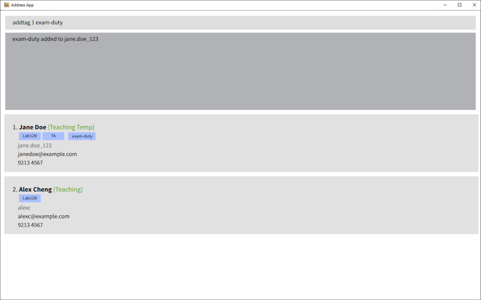

---
layout: page
title: User Guide
---

**Doritus** is an address book software for NUS teaching staff to manage student contacts. It is **optimized for use via
a Command Line Interface** (CLI) while still having the benefits of a Graphical User Interface (GUI). If you can type
fast, Doritus can get your contact management tasks done faster than traditional GUI apps.

* Table of Contents
{:toc}

--------------------------------------------------------------------------------------------------------------------

## Quick start

1. Ensure you have Java `17` or above installed on your Computer.<br>
   **Mac users:** Ensure you have the precise JDK version
   prescribed [here](https://se-education.org/guides/tutorials/javaInstallationMac.html).

1. Download the latest `.jar` file from [here](https://github.com/AY2526S2-CS2103-F13-4/tp/releases).

1. Copy the file to the folder you want to use as the _home folder_ for your Doritus data.

1. Open a command terminal, `cd` into the folder you put the jar file in, and use `java -jar` followed by the name of
   the `.jar` file you downloaded (for example `java -jar doritus-v1.5.jar`), to run the application.<br>
   A GUI similar to the below should appear in a few seconds. On a **first run with no data file yet**, the app loads
   sample contacts; if a data file already exists at `[JAR location]/data/addressbook.json` (including an empty contact
   list), that file is used instead and the list may start empty.<br>
   

1. Type the command in the command box and press Enter to execute it. e.g. typing **`help`** and pressing Enter will
   open the help window.<br>
   Some example commands you can try:

    * `list` : Lists all contacts (students and teaching staff).

    * `add n/John Doe p/98765432 e/johnd@example.com u/johndoe123 t/friends` : Adds a student.

    * `add staff n/Jane Smith p/91234567 e/jane@example.com u/janesmith` : Adds a teaching staff member. Position
      defaults to `Teaching Assistant` if omitted.

    * `staffslist` : Lists only teaching staff. `studentslist` : Lists only students.

    * `tutorslot 2 mon-10-12` : Adds Monday 10:00–12:00 availability to the 2nd person in the list (must be teaching
      staff).

    * `tutordashboard` : Shows all teaching staff and their available time slots.

    * `delete 3` : Deletes the 3rd person shown in the current list (works for both students and staff).

    * `export` : Exports all contacts currently listed to a CSV file.

    * `import f/./contacts.csv` : Imports contacts from a CSV file (generated by the `export` command) which has the path `./contacts.csv`.

    * `clear` : Deletes all contacts.

    * `exit` : Exits the app.

1. Refer to the [Features](#features) below for details of each command.

--------------------------------------------------------------------------------------------------------------------

## Features

<div markdown="block" class="alert alert-info">

**:information_source: Notes about the command format:**<br>

* Words in `UPPER_CASE` are the parameters to be supplied by the user.<br>
  e.g. in `add n/NAME`, `NAME` is a parameter which can be used as `add n/John Doe`.

* Items in square brackets are optional.<br>
  e.g `n/NAME [t/TAG]` can be used as `n/John Doe t/friend` or as `n/John Doe`.

* Items with `…` after them can be used multiple times including zero times.<br>
  e.g. `[t/TAG]…` can be used as ` ` (i.e. 0 times), `t/friend`, `t/friend t/family` etc.

* Parameters can be in any order.<br>
  e.g. if the command specifies `n/NAME p/PHONE_NUMBER`, `p/PHONE_NUMBER n/NAME` is also acceptable.

* Input extraneous parameters for commands that do not take in parameters (such as `help`, `list`, `staffslist`,
  `studentslist`, `tutordashboard`, `exit` and `clear`) will result in a format error.

* If you are using a PDF version of this document, be careful when copying and pasting commands that span multiple lines
  as space characters surrounding line-breaks may be omitted when copied over to the application.

</div>

### Duplicate contacts

* **Multiple contacts may share the same display name** (e.g. two different students both named `John Doe`) as long as
  their **phone**, **email**, and **username** are all distinct.
* A contact is rejected as a **duplicate person** only if it has the **same identity** as someone already in the book:
  same name, phone, email, and username, and—for teaching staff—the same `pos/` value (compared **case-insensitively**;
  stored as `Teaching Assistant` or `Professors`). The error message is:
  `This person already exists in the address book.`
* **Phone**, **email**, and **username** must each remain unique across contacts: two people cannot share the same
  phone number, the same email (see below), or the same username.
* **Email uniqueness** is checked in a **case-insensitive** way: addresses that differ only by letter case (e.g.
  `A@EXAMPLE.COM` and `a@example.com`) are treated as the **same** email for duplicate detection. The app still stores
  the email text as you typed it.

### Types of tags

**Note:** Tags must be **non-empty**
- General purpose tags: Alphanumeric characters only (e.g. `examDuty`)
    - Case-insensitive (e.g. `examDuty` and `examduty` are treated as equivalent tags)
- Special tags: these tags follow a specific format:
    - Tutorial groups: begins with `tut:`, followed by an optional uppercase letter and maximally 2 digits (e.g.
      `tut:A11`, `tut:17`, `tut:2`)
        - They can optionally be associated with **one** valid `course` separated by a dash (`-`). (e.g. `tut:A11-CS2103T`)
        - The associated `course` tag does not have to already be assigned to the given person
    - Lab groups: begins with `lab:`, followed by an optional uppercase letter and maximally 2 digits (e.g. `lab:A11`,
      `lab:17`, `lab:2`)
        - They can optionally be associated with **one** valid `course` separated by a dash (`-`). (e.g. `lab:A11-CS2103T`)
        - The associated `course` tag does not have to already be assigned to the given person
    - Course: begins with `course:`, followed 2-4 uppercase letters, followed by 4 digits and an optional uppercase
      suffix letter (e.g. `course:CS2103`, `course:CS2103T`, `course:GESS1000T`)

### Input history

The `up` and `down` arrow keys can be used to navigate previously entered commands within the same session.

**Behavior:**

* Only past commands that were successfully executed (did not provide an error) will be accessible

### Viewing help : `help`

Opens the help window.


Format: `help`

**Behavior:**

* Opens the help window and shows the message `Opened help window.` in the command result area.
* The help window displays a link to the online User Guide.

### Adding a student: `add`

Adds a student to the address book.

**Format:** `add n/NAME p/PHONE e/EMAIL u/USERNAME [t/TAG]…`

**Parameters:**

* `NAME`: Required.
    * Constraints for names:
        * Use only letters, numbers, and symbols: `/`, `,`, `-`, `'`, `(`, `)` and `.`
        * Cannot be empty or only whitespace.
        * Between words, use either:
          * a single space ` `,
          * hyphen `-`,
          * forward slash `/`,
          * comma and space `, `,
          * period and space `. `,
        * Must start with an alphanumeric character.
        * Must end with either alphanumeric character, closing bracket `)` or period `.`.
        * Parentheses must be at the end, properly ordered, i.e, open bracket `(` must always be followed with close bracket `)`, and non-empty.
    * Valid Examples:
        * John Doe
        * David, Tan Ah Khow
        * Lily-Rose
        * Ronald O'Donald
        * Soh La Min (Su La Min)
        * Child S/O Father
        * Donald Trump Sr.
        * J. R. R. Tolkien
* `PHONE`: Valid Singapore phone number. Exactly **8 digits in one contiguous block** (no spaces or other characters),
  must start with `3`, `6`, `8`, or `9`. Must be unique.
* `EMAIL`: Valid email format. Must be unique (see [Duplicate contacts](#duplicate-contacts)).
* `USERNAME`: Alphanumeric characters only (no spaces or special characters). Must be unique. Username uniqueness is
  case-sensitive.
* `TAG`: Optional; can be used multiple times. See [Types of tags](#types-of-tags) for more details.

**Examples:**

* `add n/John Doe p/98765432 e/johnd@example.com u/johndoe123`
* `add n/Betsy Crowe p/81234567 e/betsycrowe@example.com u/betsycrowe t/friend`
* `add n/John Doe p/98765432 e/johnd@example.com u/johndoe123 t/course:CS2103` - Adds the student John Doe belonging to
  the course CS2103

---

### Adding teaching staff: `add staff`

Adds a teaching staff member to the address book.

**Format:** `add staff n/NAME p/PHONE e/EMAIL u/USERNAME [pos/POSITION] [t/TAG]…`

**Parameters:**

* `NAME`: Required.
    * Constraints for names:
        * Use only letters, numbers, and symbols: `/`, `,`, `-`, `'`, `(`, `)` and `.`
        * Cannot be empty or only whitespace.
        * Between words, use either:
            * a single space ` `,
            * hyphen `-`,
            * forward slash `/`,
            * comma and space `, `,
            * period and space `. `,
        * Must start with an alphanumeric character.
        * Must end with either alphanumeric character, closing bracket `)` or period `.`.
        * Parentheses must be at the end, properly ordered, i.e, open bracket `(` must always be followed with close bracket `)`, and non-empty.
    * Valid Examples:
        * John Doe
        * David, Tan Ah Khow
        * Lily-Rose
        * Ronald O'Donald
        * Soh La Min (Su La Min)
        * Child S/O Father
        * Donald Trump Sr.
        * J. R. R. Tolkien
* `p/`, `e/`, `u/`: Required.
* `pos/`: Optional.
* `PHONE`: Valid Singapore phone number. Exactly **8 digits in one contiguous block** (no spaces or other characters),
  must start with `3`, `6`, `8`, or `9`. Must be unique.
* `EMAIL`: Valid email format. Must be unique (see [Duplicate contacts](#duplicate-contacts)).
* `USERNAME`: Alphanumeric only. Must be unique. Username uniqueness is case-sensitive.
* `POSITION`: Must be one of: `Teaching Assistant`, `Professors` (spelling must match; **letter case is ignored**). The
  app stores and displays the canonical form (`Teaching Assistant` or `Professors`). If omitted, defaults to
  `Teaching Assistant`.
* `TAG`: Optional; can be used multiple times. See [Types of tags](#types-of-tags) for more details.

**Behavior:**

* Position defaults to `Teaching Assistant` when `pos/` is omitted.

**Examples:**

* `add staff n/Jane Smith p/91234567 e/jane@example.com u/janesmith` — Adds teaching staff with default position
  "Teaching Assistant".
* `add staff n/Dr Lee p/91234567 e/lee@example.com u/drlee pos/Professors t/colleagues` — Adds teaching staff with full
  details.

---

### Listing all persons : `list`

Shows a list of all persons in the address book (both students and teaching staff).

**Format:** `list`

**Behavior:**

* Shows all persons in the address book.
* If the address book is empty, shows `No contacts found. Add your first contact to get started!`

---

### Listing teaching staff only : `staffslist`

Shows only teaching staff in the address book.

**Format:** `staffslist`

**Behavior:**

* Shows only teaching staff in the address book.
* If there are no teaching staff, shows `No teaching staff found.`

---

### Listing students only : `studentslist`

Shows only students (persons who are not teaching staff) in the address book.

**Format:** `studentslist`

**Behavior:**

* Shows only students in the address book.
* If there are no students, shows `No students found.`

---

### Adding a tutor availability slot : `tutorslot`

Adds an availability time slot to a teaching staff member. This allows tutors and professors to specify when they are
available to teach.

**Format:** `tutorslot INDEX SLOT`

**Parameters:**

* `INDEX`: Must be a positive integer (1, 2, 3, …) referring to the position of a **teaching staff member** in the
  **currently displayed** list. The person at that index must be a teaching staff member.
* `SLOT`: Must be in format `DAY-START-END`, where:
    * `DAY` is one of: `mon`, `tue`, `wed`, `thu`, `fri`, `sat`, `sun` (case-insensitive).
    * `START` and `END` are whole-hour values from **0 to 23**. `START` must be strictly before `END` on the same day.
      For example, `mon-23-24` is invalid because `END` must be greater than `START` within the same day; slots that
      span midnight (e.g. 23:00–01:00) are not supported.
    * `24` is outside the allowed hour range `0-23`.
    * Slots that cross midnight are not supported in the current format.

**Behavior:**

* Adding a `tutorslot` only works for a teaching staff member in the **currently displayed** list. If you are viewing a
  mixed list (`list`), use `staffslist` first so the index refers to a staff member, or expect an error if the person at
  that index is a student.
* The slot must be a same-day `DAY-START-END` whole-hour range with `START < END`; crossing midnight is invalid.
* Overlapping time slots on the same day are not allowed for the same person, including exact duplicates. For example,
  if a staff member already has `mon-10-12`, then `tutorslot 1 mon-12-14` succeeds but `tutorslot 1 mon-11-13` fails
  because it overlaps.
* Boundary-touching slots are allowed. For example, if a staff member already has `mon-10-12`, then `mon-12-14` is
  allowed because the two slots only touch at the boundary and do not overlap.
* Time slots are displayed in the UI beneath the staff member's contact details (each slot as its own label, with
  spacing between multiple slots).
* Time slots are persisted in the data file.
* Time slots are discrete. i.e. (11:00-12:00, 12:00-13:00) is different from (11:00-13:00)
* Successful additions are append-only: you can **add** multiple slots with repeated `tutorslot` commands, but there is
  **no command** to edit or remove one slot only. To change slots you may delete the staff contact and re-add them, or
  edit the data file directly (advanced; see [Editing the data file](#editing-the-data-file)).

**Examples:**

* `staffslist` then `tutorslot 1 mon-10-12` - Adds Monday 10:00-12:00 availability to the 1st teaching staff.
* `tutorslot 2 wed-14-16` - Adds Wednesday 14:00-16:00 availability to the 2nd person (must be staff).
* `tutorslot 1 fri-9-17` - Adds Friday 09:00-17:00 availability to the 1st person (must be staff).
* If a staff member already has `mon-10-12`, then `tutorslot 1 mon-12-14` succeeds but `tutorslot 1 mon-11-13` fails
  because it overlaps.

---

### Viewing tutor availability dashboard : `tutordashboard`

Displays a dashboard of all teaching staff and their available time slots, regardless of the currently displayed list.

**Format:** `tutordashboard`

**Behavior:**

* Shows **all** teaching staff in the address book — not just those visible in the current filtered list.
* For each staff member, lists their time slots sorted by day and start time.
* Displays `(no slots set)` for staff members who have no slots added yet.

* If there are no teaching staff, shows `No teaching staff found.`

**Example output:**

```
Tutor Availability Dashboard (3 tutor(s)):
1. Benson Meier: Mon 10:00-12:00, Wed 14:00-16:00
2. Daniel Meier: (no slots set)
3. George Best: Fri 09:00-11:00
```

**Examples:**

* `tutordashboard` — Shows the full availability dashboard for all teaching staff.
* After `tutorslot 1 mon-10-12`, run `tutordashboard` to confirm the slot was added.

---

### Editing a person : `edit`

Edits an existing person in the address book. For teaching staff, you can also change their position.

**Format:** `edit INDEX [n/NAME] [p/PHONE] [e/EMAIL] [u/USERNAME] [pos/POSITION] [t/TAG]…`

**Parameters:**

* `INDEX`: Must be a positive integer (1, 2, 3, …) referring to the position in the **currently displayed** list.
* At least one optional field must be provided.
* `pos/POSITION`: Only applies to teaching staff. Must be `Teaching Assistant` or `Professors` (case-insensitive). If provided while editing a student, an error will be shown.

**Behavior:**

* Updates the specified fields; unspecified fields are unchanged.
* Same validation constraints as `add` / `add staff` apply.
* **Duplicate checks:** If you edit a person's phone, email, or username to match another person's, the edit is rejected
  with the error: `This phone number already exists in the address book`, `This email already exists in the address book`,
  or `This username already exists in the address book`. This ensures phone, email, and username remain unique across all contacts.
* When editing tags, existing tags are replaced (not cumulative). Use `t/` with no value to clear all tags.
  **Examples:**

  * `edit 1 p/91234567 e/johndoe@example.com` — Edits the 1st person's phone and email.
  * `edit 2 n/Betsy Crower t/` — Edits the 2nd person's name and clears all tags.
  * `staffslist` then `edit 1 pos/Professors` — Edits the 1st teaching staff's position to Professors.

---

### Adding tags to a person : `tag-add`

Appends tags to an existing person, without having to respecify all existing tags

**Format:** `tag-add INDEX t/TAG [t/TAG]…`

**Parameters:**

* `INDEX`: Must be a positive integer (1, 2, 3, …) referring to the position in the **currently displayed** list.
* `TAG`: At least one must be provided. Can be used multiple times. See [Types of tags](#types-of-tags) for more
  details.

**Behavior:**

* Unlike the `edit` command, `tag-add` will not override existing tags. Instead, all tags specified will be added to the
  person's list of tags.
* A warning will be generated if any of the tags already exist (the command will update the existing entry with the new tag)
* If multiple duplicate tags are present, the first instance will be picked (e.g. `tag-add 1 t/theTag t/thetag`, `theTag` is used)

**Examples:**

* `tag-add 1 t/needsHelp t/course:CS2103T t/tut:10` - Adds tags to indicate that the first visible person is in the
  course CS2103T who resides in tutorial group 10 and needs help
* `tag-add 1 t/course:CS2103T t/course:CS1231S t/tut:10-CS2103T` - Adds tags to indicate that the first visible person is in the
  course CS2103T and CS1231S, specifically in tutorial group 10 of the course CS2103T

### Locating persons by name/tag: `find`

Finds persons whose names contain any of the given keywords and/or who have any of the specified tags.

**Format:**
`find [n/NAME]… [e/EMAIL]… [u/USERNAME]… [p/PHONE]… [t/TAG]…`

**Note:** At least one of NAME, EMAIL, USERNAME, PHONE or TAG must be provided.

**Behavior:**

* **Name search:** Keywords match against person names (case-insensitive)
    * The order of keywords does not matter. e.g. `Hans Bo` will match `Bo Hans`
    * Keywords is matched using substring e.g. `Han` will match `Hans`
    * Persons matching at least one keyword will be returned (i.e. `OR` search)
    * All name keywords must comply with name constraints. For instance, the keyword must only start and end with alphanumeric character
    * Refer to [`add`](#adding-a-student-add) command for constraints on names

* **Tag search:** Tags match against person tags (case-insensitive)
    * Persons with at least one matching tag will be returned (i.e. `OR` search)
    * Tags will still have to share the same tag type in order to be matched.
    * Tags are NOT matched using substring: `fri` will NOT match `friends`
    * Please refer to [Types of tags](#types-of-tags) to the format for each tag type

* **Email search:** Keywords match against person emails (case-insensitive)
    * Persons matching at least one keyword will be returned (i.e. `OR` search)
    * Keywords is matched using substring e.g. `mail` will match `example@gmail.com`
    * Keywords should be a valid substring of an email
    * Refer to [`add`](#adding-a-student-add) command for constraints on emails

* **Username search:** Keywords match against person username (case-insensitive)
    * Persons matching at least one keyword will be returned (i.e. `OR` search)
    * Keywords is matched using substring e.g. `ice` will match `alice`
    * Refer to [`add`](#adding-a-student-add) command for constraints on usernames

* **Phone Sequence search:** Each `p/` value is a **digit-only** sequence used to search within stored phone numbers.
    * Each sequence must be **1 to 8 digits** (no spaces or other characters). Values with more than 8 digits are not
      accepted.
    * Matching is by **substring** on the person's phone: e.g. `456` matches `91234567`.
    * Persons whose phone matches at least one given sequence are returned (i.e. `OR` search across `p/` values).

* **Combined search:** If multiple conditions are provided, persons must match at least one keyword in each condition (i.e. `AND` between conditions)
    * For example, `find n/alex n/bernice e/alexyeoh e/berniceyu` will match the following users:
      * Name: `Alex Yeoh`, Email: `alexyeoh@example.com` (matches `n/alex` and `e/alexyeoh` only)
      * Name: `Bernice Yu`, Email: `berniceyu@example.com` (matches `n/bernice` and `e/berniceyu` only)


**Examples:**

* `find n/John` — Returns all persons with "John" in their name
* `find n/alex n/david` — Returns `Alex Yeoh`, `David Li`, and anyone else with "alex" or "david" in their name
* `find t/friends` — Returns all persons tagged with "friends"
* `find t/colleagues t/important` — Returns all persons tagged with either "colleagues" or "important"
* `find n/John t/friends` — Returns persons with "John" in their name who are also tagged with "friends"<br>
  

---

### Deleting a person : `delete`

Deletes the specified person from the address book. Works for both students and teaching staff.

**Format:** `delete INDEX`

**Parameters:**

* `INDEX`: Must be a positive integer (1, 2, 3, …). Refers to the position in the **currently displayed** list.

**Behavior:**

* Permanently removes the person at that index. The list may be the full list (`list`), only staff (`staffslist`), or
  only students (`studentslist`).
* Operation cannot be undone.
* You will be asked to [confirm](#double-confirmation) before the deletion is carried out.

**Examples:**

* `list` then `delete 2` — Deletes the 2nd person in the full list (student or staff).
* `staffslist` then `delete 1` — Deletes the 1st teaching staff in the staff list.
* `find Betsy` then `delete 1` — Deletes the 1st person in the find results.

---

### Clearing all entries : `clear`

Clears all entries from the address book.

Format: `clear`

<div markdown="span" class="alert alert-warning">:exclamation: **Caution:**
This permanently deletes all contacts and cannot be undone. You will be asked to <a href="#double-confirmation">confirm</a> before the operation is carried out.
</div>

---

### Double confirmation

Some commands that are **irreversible** — currently `delete` and `clear` — require you to explicitly confirm before they are executed.

**How it works:**

1. Enter a critical command (e.g. `delete 1` or `clear`).
2. Doritus displays a prompt:
   ```
   Are you sure you want to execute the following command?
   "delete 1"
   Please type Y to confirm or N to cancel.
   ```
3. Type `Y` and press Enter to proceed, or `N` and press Enter to cancel.

**Behavior:**

* Typing `Y` executes the original command.
* Typing `N` cancels the command and displays `Command Cancelled!`.
* Submitting any input while a command is pending (i.e. waiting for confirmation) will **discard** the pending command.
* `Y` and `N` must be exact match to confirm, both `Y` and `N` are case-sensitive.

---

### Exiting the program : `exit`

Exits the program.

Format: `exit`

---

### Exporting contacts : `export`

Exports all contacts currently listed in the address book to a CSV file. This allows you to share or back up your contacts data.

**Format:** `export [f/FILE_PATH]`

**Parameters:**

* `f/FILE_PATH`: Optional. The file path where contacts should be exported. If not provided, exports to the default
  location (`./export.csv`). The root of this file path is the working directory of Doritus, which is represented by `.`.
  The valid path separator is `/`.

**Behavior:**
* Exports all contacts currently listed (both students and teaching staff) in the current address book to a CSV file.
* Contacts exported are affected by commands that alter the view of the address book (eg: `list`, `staffslist`, `studentslist`, `list`, `find`)
* If the file already exists, it will be overwritten.
* If the directory of the target files does not exist, Doritus will create the directory recursively
* The CSV file includes contact details such as name, phone, email, username, position, and tags.

**Examples:**

* `export` — Exports contacts to `./export.csv` (default location).
* `export f/contacts.csv` — Exports contacts to `contacts.csv` in the current directory.
* `export f/backup/students.csv` — Exports contacts to `backup/students.csv`.

---

### Importing contacts : `import`

Import contacts from the given file path of a **csv file generated by the `export` command.**

**Format:** `import f/FILE`

**Parameters:**

* `FILE`: Required. Must be a valid file path to a csv file generated from the `export` command,
  **i.e, import of any other csv file that is not generated by `export` is not allowed.**
  The root of this file path is the working directory of Doritus, which is represented by `.`.
  The valid path separator is `/`.

**Behavior:**

* **Only csv files generated by the `export` command is accepted, any other csv files will be considered invalid.**
* Thus, you cannot import any other kind of csv files that may contain contacts but is not generated by the `export` command.
* **Ensure that the csv file path is valid:**
  * If you used `export f/./contacts.csv`, then the path to the csv file is `./contacts.csv`. Thus to import the csv file, use `import f/./contacts.csv`
  * If you used `export`, then the path to the csv file will be the default path, which is `./export.csv`. Thus to import the csv file, use `import f/./export.csv`
* **Any csv file generated by `export` but tampered with, i.e, edited after running `export`, will be considered invalid format for `import`, thus `import` of such csv files will be not allowed.**
* Only the contacts who are not currently in the address book will be added.
* If an error occurs during the import, none of the contacts from the csv file will be added.

**Examples:**

* `import f/./contacts.csv` — Imports all contacts from `contacts.csv`.

---

### Saving the data

Doritus' data is saved on the hard disk automatically after any command that changes the data. There is no need to save
manually.

### Editing the data file

Doritus data are saved automatically as a JSON file `[JAR file location]/data/addressbook.json`. Advanced users are
welcome to update data directly by editing that data file.

<div markdown="span" class="alert alert-warning">:exclamation: **Caution:**
If your changes to the data file make its format invalid, Doritus will discard all data and start with an empty data file at the next run. Hence, it is recommended to take a backup of the file before editing it.<br>
Furthermore, certain edits can cause Doritus to behave in unexpected ways (e.g., if a value entered is outside of the acceptable range). Therefore, edit the data file only if you are confident that you can update it correctly.
</div>

--------------------------------------------------------------------------------------------------------------------

## FAQ

**Q**: How do I transfer my data to another Computer?<br>
**A**: Install the app on the other computer and overwrite the empty data file it creates with the file that contains
the data from your previous Doritus home folder.

--------------------------------------------------------------------------------------------------------------------

## Known issues

1. **When using multiple screens**, if you move the application to a secondary screen, and later switch to using only
   the primary screen, the GUI will open off-screen. The remedy is to delete the `preferences.json` file created by the
   application before running the application again.
2. **If you minimize the Help Window** and then run the `help` command (or use the `Help` menu, or the keyboard shortcut
   `F1`) again, the original Help Window will remain minimized, and no new Help Window will appear. The remedy is to
   manually restore the minimized Help Window.

--------------------------------------------------------------------------------------------------------------------

## Command summary

| Action                 | Format, Examples                                                                                                                                                                                                                 |
|------------------------|----------------------------------------------------------------------------------------------------------------------------------------------------------------------------------------------------------------------------------|
| **Add student**        | `add n/NAME p/PHONE e/EMAIL u/USERNAME [t/TAG]…` <br> e.g., `add n/James Ho p/82224345 e/jamesho@example.com u/jamesho t/friend`                                                                                                |
| **Add staff**          | `add staff n/NAME p/PHONE e/EMAIL u/USERNAME [pos/POSITION] [t/TAG]…` <br> e.g., `add staff n/Jane Smith p/91234567 e/jane@example.com u/janesmith` or `add staff n/Dr Lee p/91234567 e/lee@example.com u/drlee pos/Professors` |
| **List all**           | `list`                                                                                                                                                                                                                           |
| **List staff only**    | `staffslist`                                                                                                                                                                                                                     |
| **List students only** | `studentslist`                                                                                                                                                                                                                   |
| **Tutor slot**         | `tutorslot INDEX SLOT` <br> e.g., `tutorslot 1 mon-10-12`                                                                                                                                                                        |
| **Tutor dashboard**    | `tutordashboard`                                                                                                                                                                                                                 |
| **Edit**               | `edit INDEX [n/NAME] [p/PHONE] [e/EMAIL] [u/USERNAME] [pos/POSITION] [t/TAG]…​` <br> e.g., `edit 2 n/James Lee e/jameslee@example.com` or `edit 1 pos/Professors` (staff only)                                                   |
| **Add tags**  | `tag-add INDEX t/TAG [t/TAG]…` <br> e.g. `tag-add 1 t/needsHelp t/course:CS2103T t/tut:10` |
| **Find**               | `find [n/NAME]… [e/EMAIL]… [u/USERNAME]… [p/PHONE]… [t/TAG]…` <br> e.g., `find n/James Jake t/friends e/james u/jake u/james p/123`                                                                                              |
| **Delete**             | `delete INDEX` <br> e.g., `delete 3` (index from current list: full, staff, or students)                                                                                                                                         |
| **Clear**              | `clear`                                                                                                                                                                                                                          |
| **Import**             | `import f/FILE` <br> e.g., `import f/./contacts.csv`                                                                                                                                                                             |
| **Export**             | `export [f/FILE_PATH]` <br> e.g., `export` or `export f/contacts.csv`                                                                                                                                                            |
| **Help**               | `help`                                                                                                                                                                                                                           |
| **Exit**               | `exit`                                                                                                                                                                                                                           |
